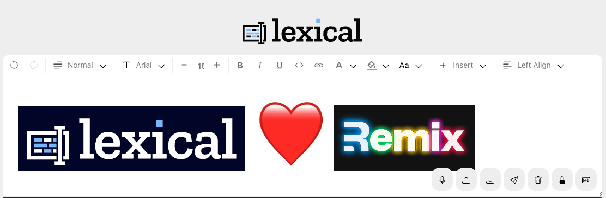

## Remix + Lexical

A quick port of the [Lexical Playground](https://playground.lexical.dev/) to Remix to show it working.

[Lexical](https://lexical.dev/) is a WYSIWIG developed by Meta/Facebook.  [Remix](https://remix.run/) is an alternative to NextJS.

- Remix v2.10
- Lexical v0.16




## Running Locally

I've used [NVM](https://github.com/nvm-sh/nvm) (Node Version Manager) and [Yarn](https://classic.yarnpkg.com/lang/en/docs/install/) package manager (yarn v3).  

If you're not familiar with NVM and Yarn, skip those steps and replace "yarn" with "npm".

1. `nvm use`
2. `yarn`
3. `yarn build`
4. `yarn dev`
5. Load in browser locally eg http://localhost:5431 (see port in command terminal)

## Remix

[Remix Readme](./README-Remix.md)

The majority of Remix code is in [/app/routes/_index.tsx](./app/routes/_index.tsx), which loads the Lexical editor on the client only.

Remix was installed with the following template:
```sh
npx create-remix@latest --template remix-run/remix/templates/remix
```

## Lexical

[Lexical Readme](./README-Lexical.md)

Lexical was copied from the [Lexical Playground](https://github.com/facebook/lexical/blob/446321d273ad2407d7f3ba383948e7cef79ad3b1/packages/lexical-playground) repo.

Lexical is a client-only library and cannot be rendered on the server.  The majority of the Lexical Playground code has been moved to a [/app/.client/](./app/.client/) to ensure it's only loaded on the client.  It cannot be server-side rendered (SSR).


.